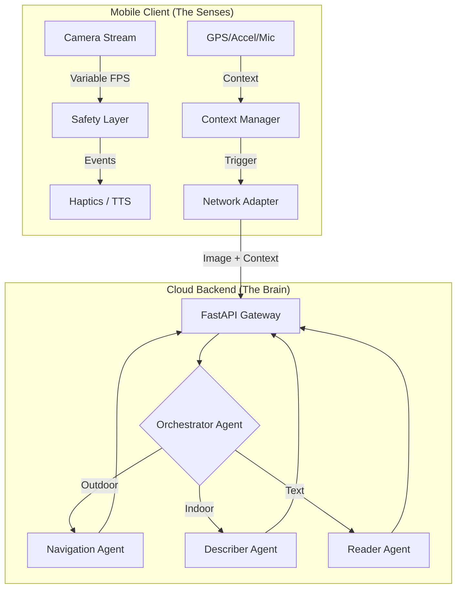

# System Design: BeMyEyes Next-Gen V2

## 1. Executive Summary
A Hybrid AI Assistive System designed to be a "Context-Aware Companion" for Visually Impaired (BLV) users. It balances immediate safety reflexes (On-Device) with deep reasoning capabilities (Cloud Multi-Agent System), prioritizing specific contexts (Indoor/Outdoor) while minimizing battery drain.

---

## 2. High-Level Architecture Diagram


---

## 3. Component Breakdown

### A. Mobile Application (Android)
**Role:** Optimized Sensor Hub & Reflex System.
*   **Safety Layer (The Reflex):**
    *   Runs **Offline** (On-Device).
    *   Uses lightweight models (e.g., TFLite / MediaPipe) for *only* critical hazards: "Car", "Gap/Hole", "Person".
    *   **Latency:** < 100ms.
*   **Context Manager:**
    *   Determines: "Is the user moving?", "Are they indoors?", "Is battery low?".
    *   **Power Optimization Strategy:**
        *   **Dynamic Polling:** High FPS (30fps) only when moving fast. Low FPS (1fps) when stationary/indoor.
        *   **Curtain Mode:** Shuts off screen rendering (OLED off) while camera runs.
*   **Interaction Layer:**
    *   Voice-First (Wake Word or Tap-to-Speak).
    *   Haptic Language (Vibration Patterns).

### B. Backend System (Multi-Agent)
**Role:** Reasoning & Task Execution.
*   **Tech Stack:** Python + FastAPI.
*   **Orchestrator:**
    *   Analyzes the "Intent" (from Voice) + "Context" (from Sensors).
    *   Routes task to specific Sub-Agents.
*   **Agents:**
    1.  **Navigation Agent:** Specialized in crosswalks, street signs, GPS correlation.
    2.  **Indoor Agent:** Focuses on furniture, objects, doors.
    3.  **Reader Agent:** Pure OCR (Optical Character Recognition) for high-fidelity text reading.

### C. User Interaction (UX)
*   **Philosophy:** "Companion, not Tool."
*   **Input:** Natural Language ("Where is the exit?").
*   **Output:** Conversational + Directional Audio ("Door is at 2 o'clock").

---

## 4. Technology Stack Selection

| Component | Technology | Rationale |
| :--- | :--- | :--- |
| **Mobile OS** | Android (Kotlin) | Strong CameraX support, Background Services. |
| **On-Device ML** | MLKit / MediaPipe | Optimized for Mobile, low battery impact. |
| **Backend API** | Python FastAPI | Async performance, rich AI ecosystem. |
| **Agent Framework** | LangGraph / AutoGen | Orchestrating stateful multi-step reasoning. |
| **Large Model** | Gemini 1.5 Pro / GPT-4o | Multimodal Vision understanding. |
| **Communication** | WebSockets (Proposed) | Real-time bi-directional audio/state streaming. |

---

## 5. Critical Constraints
1.  **Power Consumption:** Running Camera + ML continuously drains battery.
    *   *Mitigation:* **Dynamic Duty Cycling** (Slowing down processing when not needed).
2.  **Latency:** Cloud Analysis takes 1-3 seconds.
    *   *Mitigation:* Split responsibilities. Safety = Local (fast). Details = Cloud (slow).
3.  **Connectivity:** Blind users in subways/elevators.
    *   *Mitigation:* "Offline Mode" reduces functionality but keeps Safety Layer active.

## 6. Detailed Module Breakdown & Interaction

### A. Mobile Client Internal Structure
The Android app is not just a UI; it is a **State Machine**.
*   **Sensor Service (Background):**
    *   Manages CameraX (ImageAnalysis uses dynamic resolution).
    *   Manages Location via `FusedLocationProvider` (updates only when moving).
*   **State Manager (ViewModel/Logic):**
    *   **IDLE:** Monitoring sensors at low power.
    *   **ALERT:** Local model detected hazard -> Triggers Immediate Vibrate.
    *   **ACTIVE:** User asked question -> Capturing high-res image -> Sending to Cloud.
*   **Audio Manager:**
    *   Handles "Wake Word" listen loop (e.g., "Hey Guide").
    *   Manages TTS Priority (Safety Warning > Navigation Instruction).

### B. Backend Agent Structure (FastAPI)
The backend is a pipeline, not just a single endpoint.
1.  **Ingress (API Gateway):** Validates API Key, Rate Limits, and Decodes Payload.
2.  **Context Router:**
    *   Input: `UserRequest` + `Telemetry` (Speed, GPS).
    *   Logic: `if speed > 4kmh -> route to Navigator`.
3.  **Agent Pool:**
    *   **`SafetyAgent` (Vision):** Checks for immediate dangers missed by local device.
    *   **`TaskAgent` (LLM):** Answers specific questions ("Is this milk expired?").
    *   **`NavigationAgent` (Geo+Vision):** Correlates visual landmarks with Map data.

### C. Interaction Protocol (The "Contract")
Communication happens via a **Stateful REST** or **WebSocket** connection.

#### Request Payload (Mobile -> Cloud)
```json
{
  "session_id": "uuid-1234",
  "request_type": "PASSIVE_UPDATE", // or "USER_QUERY"
  "timestamp": 1708992000,
  "telemetry": {
    "gps": { "lat": 40.71, "lon": -74.00, "speed_mps": 1.2 },
    "device_status": { "battery": 0.45, "network": "4G" }
  },
  "audio_query": "What store is this?", // Optional
  "image_data": "base64_string..." // Resized based on context
}
```

#### Response Payload (Cloud -> Mobile)
```json
{
  "status": "SUCCESS",
  "agent_used": "NavigationAgent",
  "priority": "HIGH", // HIGH interrupts current speech, LOW queues it
  "actions": [
    { 
      "type": "TTS", 
      "content": "You are passing Starbucks on your right." 
    },
    { 
      "type": "HAPTIC", 
      "pattern": "DOUBLE_PULSE" 
    }
  ]
}
```

## 7. User Requirements Matrix & Architectural Analysis

To design the backend effectively, we must analyze the specific needs of each scenario. "Awareness" means different things in different contexts.

| Use Case | Latency Req | Importance | Cost (Compute) | Awareness Goal | Recommended Approach |
| :--- | :--- | :--- | :--- | :--- | :--- |
| **Street Crossing** | **Critical (<200ms)** | **High (Safety)** | Low (Frequent) | "Safe to walk?" (Cars/Lights) | **Edge ONLY.** (YOLO/TFLite on Android). Cloud is too slow/risky. |
| **Sidewalk Navigation** | Medium (<1s) | Medium | Medium | "Stay on path, avoid poles" | **Hybrid.** Edge for obstacles, Cloud (Flash) for path planning updates every 3s. |
| **Reading Mail/Menus** | Low (>3s ok) | High (Accuracy) | High (OCR) | "Financial details/Food items" | **Specialized Cloud.** (Google Vision/OCR Agent). No hallucination allowed. |
| **Finding Keys/Item** | Medium (<1s) | Low (Convenience)| High (Object search) | "Where is it relative to hand?" | **Video Agent.** (Gemini Flash). Needs continuous stream to guide hand. |
| **Ambient/Social** | Low (>5s ok) | Low (Enrichment) | High (VQA) | "Who is here? What is the vibe?" | **Deep Cloud.** (Gemini Pro). Rich, poetic description. |

### analysis & Architectural Implications
1.  **Safety cannot be Cloud-based.** The "Street Crossing" case proves we *must* keep a robust On-Device Safety Layer (Pillar A) regardless of how smart the backend is.
2.  **The "Router" must be fast.** We can't afford to send a "Street Crossing" image to a slow "Reading Agent" first. The Router needs to be a lightweight classifier (or determined by GPS context).
3.  **Cost Control:** "Ambient" queries are expensive and low priority. We should only trigger them on explicit user request ("Describe the room"), whereas "Navigation" might need a continuous (but lower cost) stream.
