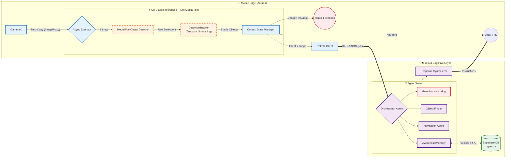

# Mission-Driven Agentic System: System Architecture (V2)

**Project:** BeMyEyes Next-Gen (Hybrid AI Assistant)
**Status:** V2 Complete (Production Ready)
**Author:** Armin Mehran

---

## 1. Executive Summary
This project represents a paradigm shift in assistive technology for the visually impaired. Moving beyond generic "image captioning," we have engineered a **Mission-Driven Agentic System** that mimics human cognition. The architecture implements a **Hybrid AI Strategy**, balancing sub-100ms on-device safety reflexes with powerful cloud-based reasoning agents.

**Core Philosophy:** *Context determines Behavior.* A user crossing a street needs immediate warnings (Guardian Agent), while a user looking for keys needs spatial guidance (Finder Agent). One model cannot solve both effectively; a swarm of specialized agents can.

---

## 2. High-Level Architecture (Hybrid AI)



The system is distributed across two compute environments to optimize for **Latency**, **Privacy**, and **Intelligence**.

### A. The Edge Layer (Android/Kotlin)
*Role: The Distributor & Reflex System*
*   **The Distributor (Input Processing):** Captures the CameraX stream and decides where to route the signal.
    *   **Immediate Feedback (On-Device):** Low-latency path for Safety/Critical hazards.
    *   **Cloud Pipeline:** High-latency path for complex reasoning.
*   **Technology:** MediaPipe Tasks, CameraX (Zero-Copy Pipeline), Kotlin Coroutines.
*   **Responsibility:**
    *   **Real-time Object Detection:** Running `EfficientDet-Lite2` at 30fps to track dynamic objects.
    *   **Temporal Smoothing:** Custom `DetectionTracker` to filter sensor noise and object flicker.
    *   **Immediate Haptics:** Vibration feedback for obstacles (0 latency).
    *   **Persistent Identity:** Generates unique UUID (`UserPreferences`) to enable personalized long-term memory.
    *   **Curtain Mode:** Privacy-first implementation (screen off, AI on) to preserve battery and dignity.

### B. The Cognitive Layer (Cloud Backend)
*Role: The Reasoning System (Deep, Context-Aware, Multi-Modal)*
*   **Technology:** Python, FastAPI, Google Cloud Run (Serverless), Google Gemini 1.5 Flash.
*   **Persistence:** Supabase (PostgreSQL) with `pgvector` for Semantic Search.
*   **Structure:**
    1.  **Cloud Orchestrator Agent:** The entry point that creates the shared context.
    2.  **Safety & Critical Path:** Parallel execution of Watchdog agents to catch missed local threats.
    3.  **Mission Subgraph:** Specialized agents (Navigation, Object Detection, Reading) that execute complex tasks based on the "Nav Needed" logic.
    4.  **Final Action Synthesizer:** Aggregates outputs from all agents to form a coherent response (Speech + Haptics).

---

## 3. Backend Agent Architecture (The Swarm)

Instead of a monolithic LLM, the backend utilizes an **Orchestrator-Worker** pattern. This allows for modular prompt engineering, isolated failure domains, and specialized context windows.

### 1. The Orchestrator (Router)
*   **Input:** User Audio + Image + Telemetry.
*   **Logic:** Semantic classification of intent.
    *   *Intent: "Watch out!"* -> Route to **Guardian**.
    *   *Intent: "Where is my coffee?"* -> Route to **Object Finder**.
    *   *Intent: "Read this."* -> Route to **Reader**.
    *   *Intent: "Describe view."* -> Route to **Awareness**.
*   **Skill:** Dynamic dependency injection of agents based on runtime classification.

### 2. The Map Service (Spatial Awareness)
*   **Mission:** Understand relative geometry using Telemetry.
*   **Logic:**
    *   Receives `Heading` (Compass) and `Pitch` from Android.
    *   Calculates object position relative to user (e.g., "12 o'clock", "Left 90 deg").
    *   Injects spatial context into `AwarenessAgent` prompts.

### 3. The Guardian Agent (Safety First)
*   **Mission:** Detect immediate physical threats (Traffic, Drop-offs, Obstacles).
*   **Prompt Strategy:** Extreme brevity. High-priority interrupt.
*   **Output:** "STOP. Car approaching left."

### 4. The Object Finder Agent (The Seeker)
*   **Mission:** Locate specific items relative to the user.
*   **AI Technique:** **Spatial Anchoring**. The System Prompt instructs the model to analyze the image grid and output coordinates as "Clock Face" directions (e.g., "Keys are at 2 o'clock, 1 meter away").
*   **Safety:** Filters out hallucinations by demanding visual evidence.

### 5. The Navigation Agents (Context-Specific)
*   **Indoor Agent:** Focuses on micro-navigation (Doors, Chairs, Hallways).
*   **Outdoor Agent:** Focuses on macro-navigation (Sidewalks, Poles, Intersections).
*   **Skill:** Context switching based on visual scene classification.

### 6. The Awareness Agent (Cognitive Persistence)
*   **Mission:** Long-Term Memory and Contextual Awareness.
*   **Component:** `MemoryService` + `Supabase`.
*   **Logic:**
    1.  **Ingestion:** Converts User Input & Scene Description into **Vector Embeddings** (Gemini text-embedding-004).
    2.  **Recall:** Queries `memories` table via RPC `match_memories` to find relevant past facts.
    3.  **Synthesis:** Injects past context (e.g., "User left keys on table") into current prompt.

---

## 4. Technical Stack & Protocol

### API Protocol
Communication follows a strict JSON contract defined in `AnalysisRequest` and `AnalysisResponse`.

**Request:**
```json
{
  "image_base64": "<string>",
  "query": "Where is the door?",
  "user_intent": "NAVIGATION",
  "user_id": "550e8400-e29b-41d4-a716-446655440000", // UUID for Memory Partitioning
  "telemetry": { ... }
}
```

**Response:**
```json
{
  "agent_id": "indoor_navigator",
  "response_text": "The door is 3 steps ahead, slightly to your right.",
  "actions": [
    { "type": "HAPTIC_PULSE" }, // Physical feedback
    { "type": "TTS_SPEAK" }
  ]
}
```

### Deployment (CI/CD)
*   **Containerization:** Docker (Multi-stage python builds).
*   **Infrastructure:** Google Cloud Run (Auto-scaling Serverless).
*   **Pipeline:** GitHub Actions (`deploy-backend.yml`) triggers strict linting and deployment on push to `main` or `dev`.

---

## 5. Development Methodology
*   **TDD (Test Driven Development):** Backend Agents and Memory Service are fully tested (`pytest`).
*   **Clean Architecture:** Implementation of Repository Pattern and Dependency Injection (Hilt/FastAPI-Depends) ensures testability and separation of concerns.

---

## 6. Roadmap (V3: The Cognitive Leap)
*   **Phase 6: Long-Term Memory (PostgreSQL):** **[LIVE]** Persisting user anchors across sessions using Supabase Vectors.
*   **Phase 7: Precision Telemetry:** Fusing GPS/Compass data with Vision for SLAM (Simultaneous Localization and Mapping).
*   **Phase 8: Social Intelligence:** Facial recognition and social cue interpretation.
*   **Phase 8: Social Intelligence:** Facial recognition and social cue interpretation.
